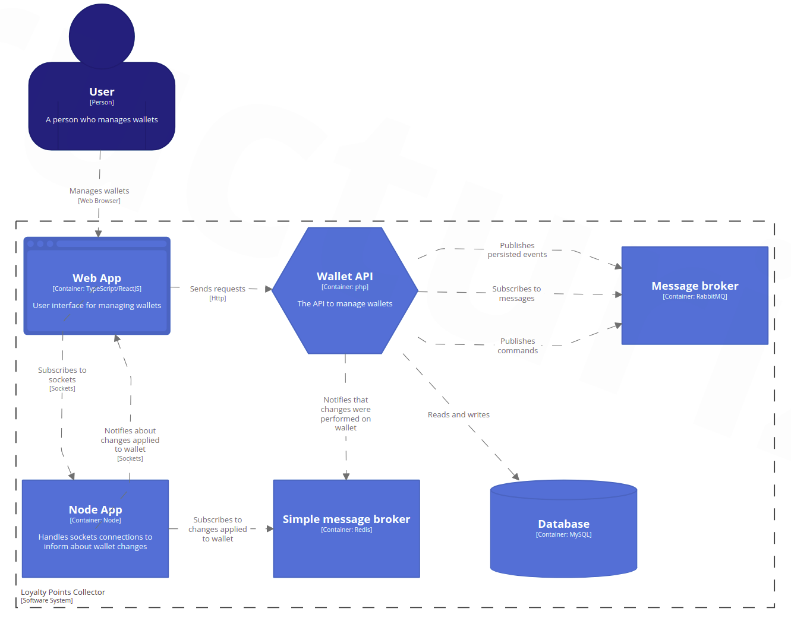

# Loyalty Points Collector

## Description
This is a demo application that uses the CQRS pattern and asynchronous communication.  
Its purpose is to collect loyalty points. Logged in user can create wallets and add points to them.
Added points are asynchronously applied both on the wallet details view and on the wallets list.

## Setup
The application contains Makefile. To quickly install all dependencies, just type 
`make setup`

## Running the app
Create .env file from .env.dist  
Create .env file from .env.dist in frontend directory  
Run the command: `make start`

The application is available on the address `http://localhost:8080` 

User credentials:  
- username: admin
- password: admin1

## API documentation
The API documentation is available on `http://localhost/api/doc`

## Model

