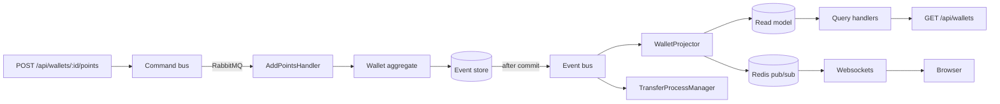
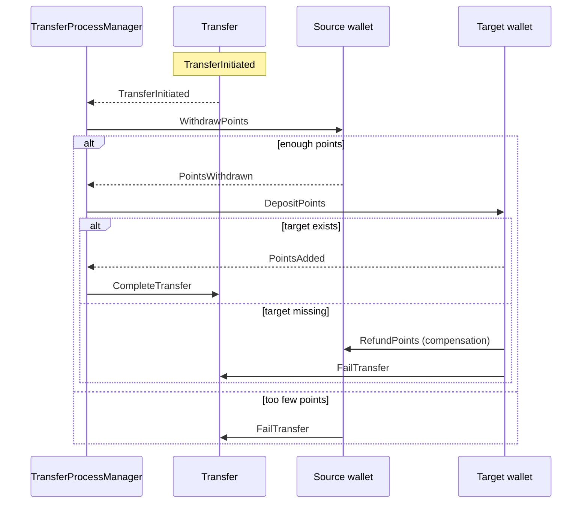

# Loyalty Points Collector

Event-sourced CQRS demo built on Symfony 7.4 / PHP 8.5: wallets collect loyalty points,
and points can be transferred between wallets by a **saga (process manager)** that
compensates when a step fails.

The interesting part is not the CRUD — it is what sits underneath: a hand-written event
store with optimistic locking, asynchronous projectors driving a separate read model,
and a long-running business process spanning three aggregates without a distributed
transaction.

```bash
make install && make check
```

---

## What it does

- Create a wallet, add points to it.
- Transfer points between two wallets. The transfer is asynchronous and eventually
  consistent: the API answers `202` with a `transferId`, and the outcome becomes
  readable from `GET /api/transfers/{id}` once the saga settles.
- Every balance change is pushed to the browser over Redis pub/sub → websockets, so
  open pages update without polling.

Transfers can fail in two ways, and both are handled as business outcomes rather than
errors: the source wallet may hold too few points (nothing moves), or the target wallet
may not exist (the debit is **compensated by a refund**). Neither leaves money missing.

## Running it

Requirements: Docker and Docker Compose. Nothing else — PHP, Composer and Node all run
inside containers.

```bash
make install
```

```bash
make up
```

| Service | URL |
|---|---|
| Frontend | http://localhost:5173 |
| API | http://localhost:8080 |
| API docs (OpenAPI) | http://localhost:8080/api/doc |
| RabbitMQ management | http://localhost:15673 |

Demo credentials: **admin / admin1**.

Ports are configurable if something else on your machine already uses them:

```bash
APP_PORT=8090 FRONTEND_PORT=5175 make up
```

Run `make help` to see every target.

## Architecture

Hexagonal layering inside a bounded context, with a shared kernel for the
event-sourcing machinery. Dependencies point inwards and **PHPArkitect enforces it**
(`make arch`) — the rules are not decoration, they fail the build.

```
src/
├── Loyalty/                      the bounded context
│   ├── Domain/                   aggregates, value objects, domain events, ports
│   │   ├── Wallet/               Wallet aggregate — owns the balance invariant
│   │   └── Transfer/             Transfer aggregate — owns the transfer lifecycle
│   ├── Application/              use cases; depends on Domain only
│   │   ├── Command/              write side: commands + handlers
│   │   ├── Query/                read side: queries + handlers (synchronous, no bus)
│   │   ├── Event/                TransferProcessManager — the saga
│   │   └── ReadModel/            read-model ports and view DTOs
│   ├── Infrastructure/           adapters: DBAL repositories, projectors, read models
│   └── UserInterface/            HTTP controllers, request DTOs
└── Shared/                       shared kernel
    ├── Domain/EventSourcing/     AggregateRoot, DomainEvent, EventStore port
    ├── Application/              bus and notifier ports
    ├── Infrastructure/           DBAL event store, Messenger buses, Redis notifier
    └── UserInterface/            exception → HTTP mapping
```

### How a write flows


```mermaid
flowchart LR
    HTTP[POST /api/wallets/:id/points] --> CB[Command bus]
    CB -->|RabbitMQ| CH[AddPointsHandler]
    CH --> AGG[Wallet aggregate]
    AGG --> ES[(Event store)]
    ES -->|after commit| EB[Event bus]
    EB --> PROJ[WalletProjector]
    EB --> PM[TransferProcessManager]
    PROJ --> RM[(Read model)]
    PROJ --> REDIS[(Redis pub/sub)]
    REDIS --> WS[Websockets] --> UI[Browser]
    RM --> QUERY[Query handlers] --> HTTPGET[GET /api/wallets]
```

Events reach the event bus only **after** the surrounding transaction commits
(`DispatchAfterCurrentBusStamp`), so a projector can never observe state that a later
failure rolls back.

### The transfer saga

Three aggregates, no distributed transaction. Each step is its own command in its own
transaction, and failure paths compensate rather than roll back.


```mermaid
sequenceDiagram
    participant PM as TransferProcessManager
    participant T as Transfer
    participant S as Source wallet
    participant D as Target wallet

    Note over T: TransferInitiated
    T-->>PM: TransferInitiated
    PM->>S: WithdrawPoints

    alt enough points
        S-->>PM: PointsWithdrawn
        PM->>D: DepositPoints
        alt target exists
            D-->>PM: PointsAdded
            PM->>T: CompleteTransfer
        else target missing
            D->>S: RefundPoints (compensation)
            D->>T: FailTransfer
        end
    else too few points
        S->>T: FailTransfer
    end
```

The wallets know nothing about transfers, and the `Transfer` aggregate moves no points —
it only tracks the lifecycle. The process manager is what turns three independent,
individually-consistent aggregates into one business operation.

### Event store

`events` is append-only, with a unique index on `(aggregate_id, version)`. That index
*is* the concurrency control: a writer passes the version it loaded, and a second
concurrent writer for the same version hits the constraint and gets a
`ConcurrencyConflict` instead of silently interleaving two streams.

Events are stored under registered names (`wallet_created`, `points_added`, …), never
under their PHP class name — an event stream outlives any particular namespace layout,
so renaming a class must not turn into a data migration.

## Quality gates

```bash
make check
```

| Command | What it checks |
|---|---|
| `make cs` | PHP-CS-Fixer, `@Symfony` + strict types |
| `make stan` | PHPStan **level 9** with strict rules, **no baseline** |
| `make arch` | PHPArkitect layer rules |
| `make test` | 77 tests across three suites |

| Suite | Scope |
|---|---|
| `Unit` | Aggregates (given events → when command → then events), value objects, the saga wired in-process |
| `Integration` | Real MySQL: event store round trip, optimistic-locking conflict, projectors |
| `Functional` | Real HTTP: auth, validation, the full transfer saga end to end |

Every use case has a happy path and at least one negative case — insufficient points,
a missing wallet, an invalid payload, a redelivered message.

## Deliberate omissions

Things a reviewer might expect that are **intentionally absent**:

- **Snapshots.** They solve slow rehydration of long streams. These aggregates have a
  handful of events each, so a snapshot would add cache-invalidation problems in
  exchange for no measurable gain.
- **A separate read database.** CQRS separates *models*, not necessarily storage. The
  read model is its own set of flat tables; splitting the physical database would add
  operational cost this demo cannot justify.
- **Refresh tokens.** Dropped along with the bundle: with one in-memory demo user they
  add a moving part that hides authentication problems rather than solving them.
- **An ORM.** The write side persists serialized events and the read side is flat SQL.
  Doctrine ORM would be mapped over nothing.
